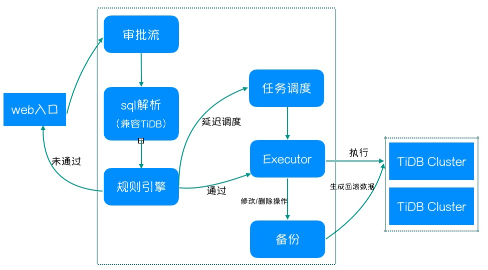

<div align="left">

**简体中文 | [English](../README.md)**

</div>

#### Owl 简介

Owl 是伴鱼基于公司内部场景，开发的一个数据库SQL审核平台，致力于规范研发同学的建表、索引、数据安全等操作。
提供的功能主要包括：
* 登陆认证：基于Ldap的登陆认证
* 流程审批：支持两级审核，管理员(DBA)和研发
* 规则列表：支持动态开启与关闭审核规则
* SQL自动检测：通过TiDB Parser做SQL语法检测
* SQL规则引擎：通过一套规则，规范SQL上线
* SQL定时执行：风险操作，调度到低峰期执行
* 数据备份和回滚：对于DML操作，备份操作前的数据，并支持回滚
* 批量提交：支持一个输入框内提交多个sql，以分号分隔



#### 功能简介

具体请参考[功能介绍](./introduction.md)

## 部署及使用

### 部署环境

Owl是前后端分离的架构，后端基于go的gin web框架编写，依赖的基础环境包括：
* go 1.3+
* tidb、mysql（主要用于后端元数据存储）

前端基于react的ant design pro框架编写，依赖的基础环境包括：
* node
* yarn (npm)

### 后端单独部署

1、安装go环境
```
[root@dongfengtest-host-0 local]# go version
go version go1.16.7 linux/amd64
```
2、下载后端代码到本地目录
```
[root@dongfengtest-host-0 sql_audit]# git clone https://github.com/ibanyu/owl.git                                                        ^C
[root@dongfengtest-host-0 sql_audit]#
[root@dongfengtest-host-0 sql_audit]# ls
owl
```
3、编辑配置文件，将config/目录下config-example.yml重命名成config.yml，并配置好数据库和Ldap配置
```
db:
  address: "xx.xx.xx.xx"
  port: xx
  user: "xx"
  password: "xx"
  db_name: "owl"
  max_idle_conn: 2
  max_open_conn: 30

login:
  ldap:
    host: "ldap.test.com"
    port: 389
    base_dn: "dc=test,dc=com"
    use_ssl: false
    bind_dn: "cn=hi,dc=test,dc=com"
    bind_pwd: "password"
  login_path: "https://xx.com/login"
  token_secret: ""
  token_effective_hour: 1
```
4、初始化数据库  
* 创建数据库：``` CREATE DATABASE `owl`; use owl ```  
* 初始化表：使用[build_table.sql](../dao/build_table.sql)的sql初始化表  
* 添加首位管理员： ``` insert into owl_admin (username,description) values ('your ldap name','first admin'); ```  

5、编译运行

```
# 一键启动
make run

# 一键docker启动
make run-docker

# 仅构建后端
make build

# 交叉编译后端
make build-linux

# 获取UI并置于static目录
make build-front

# 编译docker镜像
make build-docker
```
### 开发计划

* mysql分库分表工具支持（gh-ost）
* 数据库权限控制
* 查询语句支持

### 如何参与贡献

* 提交bug：通过issue的方式提交bug。
* 贡献代码：fork仓库，进行代码变更，提交pr。
* 参与设计讨论：通过issue或者pr（/doc）提交设计文档，并讨论。

## 社区

微信群:


## License

[Apache 2.0 License](./LICENSE)