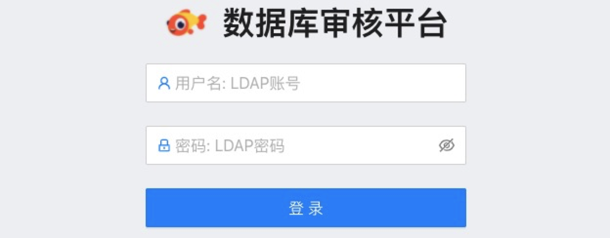
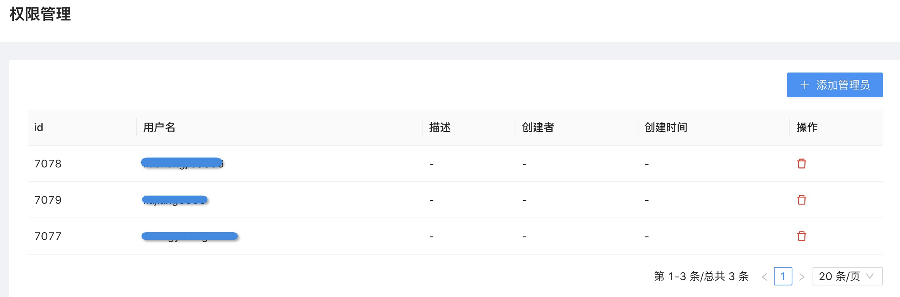
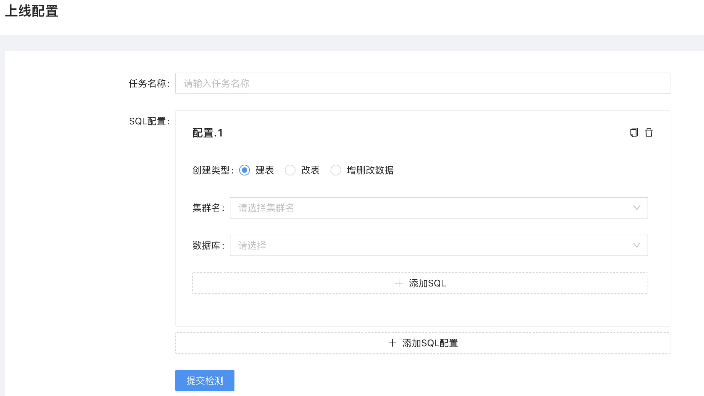
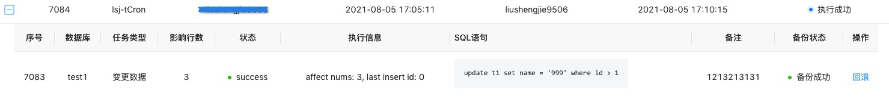
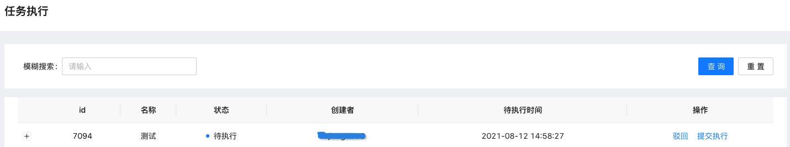

# Owl简介 
Owl是伴鱼基于TiDB生态开发的一款SQL审核工具，完全兼容TiDB的语法，主要提供的核心功能如下： 
* 基于TiDB Parse的SQL语法解析，完全兼容TiDB语法 
* 基于LDAP的登陆权限验证 
* 支持两级工单审核流 
* 支持基于审核规则列表的动态开关 
* 支持SQL执行数据备份和回滚 
* 支持SQL任务定时调度执行 

Owl的整体架构如下图：

 

# Owl功能说明 
## 前言 

Owl是伴鱼结合自身使用TiDB的一些场景开发的SQL审核工具，旨在规范研发的SQL上线和提高DBA的上线效率。伴鱼在运维数据库的过程中，得到了TUG社区极大的帮助，开源SQL审核工具，旨在回馈社区。如果你选择使用，欢迎提出建议，也可以根据你的场景定制化开发。 

## 功能说明 
### 登陆认证 

考虑到很多公司都有基于Ldap的权限认证，我们没有单独设计权限认证模块。你在系统搭建时，配置好Ldap地址，系统就支持登陆认证了。 

 

### 工单审核流 

开源版本，我们只做了两级审核流，一个是管理员，一个是普通用户，方便接入。如果不满足你的需求，你可以结合自己公司的组织架构，通过定制做多级审核流。 

 

### 上线配置 

我们将上线类型分为3类：建表、改表和增删改数据，主要是做细粒度的控制。比如DBA关注建表的索引，需要自己控制准入，而对于改表和增删改数据，权限可以开放给leader审核操作等。同时，Owl的上线配置，支持一个工单多集群多库多表上线。 

 

### 规则列表 

我们把表涉及的一些规范，做成了动态开关，你可以结合自身的场景，灵活开启与关闭。
 
 

比如对于线上删改数据的高风险操作，我们有以下几个规则： 
* 删改数据索引不完全匹配 
* 删改数据影响行数超过100 
* 影响行数超过3000 

下面对这3条规则进行解释： 
* 日常数据修改，大多数场景只涉及少部分数据修改，所以只要完全走索引，性能基本没问题。如果系统检测到语句条件与线上索引不完全匹配，检测结果就会不通过。 
* 在某些特殊场景下，索引完全匹配，但数据影响的实际行数可能较多(大于配置影响行数 100)，这样检测结果也是不通过。 
* 当然在表数据量不大(万级别以内)和索引没法覆盖等极少数场景下，可以通过关闭1、2两条规则，同时满足3这条规则的前提下，检测通过。 

规则这样配置，一方面系统根据语句条件备份时，保证了快速高效；其次，数据执行权限已经下放给业务负责人，系统尽可能保证SQL的执行性能。当然对于大批量数据修改，系统可能不太合适。 

### 数据回滚 

DML SQL语句执行时，我们通过解析SQL语句拿到更新的条件，根据条件备份操作前的数据。如果操作需要回滚，我们根据备份好的数据，执行回滚操作。 

 

### 调度执行 

对于某些任务，我们可以通过设置调度时间，让其在某个时间点定时调度执行。同时对于定时任务，我们也可以重新修改调度时间或者立即执行。 

